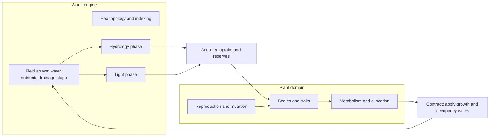

# Meadow simulation architecture — design spec

**Status:** Draft for implementation planning  
**Date:** 2026-03-21  
**Sources:** `docs/Vision and Design.md`, brainstorming session 2026-03-21  
**Practice context:** *Growth Is Not Optional* (`Growth-Is-Not-Optional-Jurphs-SW-Eng-Journey.md`, e.g. under `jurph-project-template`)

---

## 1. Purpose

Build a **hex-grid meadow simulation** where **plants** and **hex tiles** interact through moisture, nutrients, sunlight, drainage, and slope-driven flow, with evolution-friendly traits, reproduction, and decay. Target scale: **200×200** hexes (~2 m² at centimeter hexes). Gameplay and debug UX (seed placement, plant designer) come **after** the simulation core is trustworthy.

This spec defines **architecture and contracts first**. It deliberately does **not** optimize for an early visible “win” (no demo-first milestone). The first deliverables are **boundaries, types, and tests that encode invariants**, so later features (grass vs taproot vs woody stems, crowding, mutations) plug into a stable core.

---

## 2. Alignment with *Growth Is Not Optional*

The manifesto asks for deliberate practice: briefs, pure vs orchestration split, tests as design, typing at boundaries, explicit dependencies, and cheap future changes. This project maps those as follows.

| Manifesto theme | Meadow application |
|-----------------|-------------------|
| **Brief before heavy abstraction** | `docs/Vision and Design.md` remains the product north star; this spec adds **engineering** constraints only. |
| **Pure logic vs orchestration** | **Orchestration:** turn pipeline (ordered phases), wiring subsystems, I/O later. **Pure (or isolated):** hex coordinate math, trait/mutation transforms on immutable snapshots, flow step rules given fixed inputs, allocation decisions given fixed pools (where practical). |
| **Tests as a design tool** | Tests target **contracts and invariants** (mass balance, valid hex indices, phase ordering, “no negative reserves” at boundaries), not implementation trivia. A test that needs huge mocks signals a missing seam. |
| **Typing as communication** | **Protocols / ABCs** at subsystem edges first (`WorldView`, `PlantSink`, phase interfaces). Core records use typed attrs or dataclasses; avoid anonymous dict soup at boundaries. |
| **Dependencies as design** | **Core:** `numpy` for field storage (explicit in `pyproject.toml` when added). **Performance:** `numba` (or similar) only after hot paths are identified; not a day-one dependency. **UI later:** optional, isolated. |
| **Optimize for the next change being cheap** | **Two-layer domain split** (§4): grid/world engine vs plant domain, narrow interfaces so grass vs dandelion vs bush stay **data + rules**, not copy-paste classes. |
| **First user-visible workflow** | Manifesto default: ship a thin user-visible slice early. **Exception for meadow:** user has chosen **foundations-first**; the “first slice” is **contract compliance + one integration tick on a toy grid**, not a polished plop-UX. The first **player-visible** milestone is explicitly scheduled **after** invariants exist (see §8). |

---

## 3. Goals and non-goals

### 3.1 Goals

- **Correct structure:** `HexTile` field evolution and **Plant** behavior are separate subsystems with explicit contracts.
- **Explicit turn model:** Weather → flow → light → uptake → depletion/damage → growth/reproduction/decay, as in the Vision doc (exact sub-steps versioned in code as named phases).
- **Extensible plant encoding:** Growth forms (clump grass, taproot, woody stems) are **parameters + allocation rules**, not ad-hoc branches scattered through the engine.
- **Observable internals:** Later debug UI attaches to **stable read APIs** (snapshot / query), not private arrays.

### 3.2 Non-goals (initial phases)

- Photoreal rendering or high-performance GPU paths.
- Full ecological realism in hydrology or genetics in v1.
- Locking final UX for seed placement or sidebar before simulation contracts stabilize.

---

## 4. High-level architecture

### 4.1 Two layers

1. **World / grid engine**  
   Owns hex topology, per-tile scalar fields (moisture, nutrients, drainage, slope-related inputs), routing of water and nutrients, sunlight availability per tile, occupancy / primary resident, and hooks for decay inputs. Exposes **read** views to plants and **controlled write** paths for phase handlers.

2. **Plant domain**  
   Owns plant identity, body plans (root / leaf / stem occupancy over hexes), trait vectors, metabolism (uptake → energy / cellulose), growth allocation, reproduction, death, and mutation. Interacts with the world **only** through the contracts in §5.

### 4.2 Orchestration vs pure core

- **`Simulation` / `TurnPipeline`:** orchestration only — validates phase order, passes context objects, no physics formulas inline.
- **Phase implementations:** may call pure helpers (e.g. “distribute flow for one step”) kept in testable modules.
- **Plant allocation:** prefer **pure functions** from “state + trait snapshot + available increments” → “proposed deltas”; a thin adapter applies deltas to the world.

---

## 5. Contracts (interfaces first)

Contracts are **stability points**. Implementations can start minimal; tests depend on **behavior** described here, not private fields.

### 5.1 Coordinate and topology

- **`Hex` / `Axial`:** `(q, r)` (or equivalent) with documented rectangular 200×200 mapping and bounds checks.
- **`Topology`:** neighbors, distance, iteration over disk footprints (for 1 / 7 / 19 hex patterns as the design evolves).

**Contract:** Invalid coordinates are rejected or mapped to a sentinel consistently; no silent wrap (tests enforce).

### 5.2 World read surface (for plants)

A **`WorldView`** (Protocol or ABC) used during plant decisions:

- Read moisture, nutrients, light at a hex.
- Query primary occupant, reserved roots, and any crowding flags needed for the current design epoch.

No plant code reaches into global numpy arrays directly.

### 5.3 World write surface (phase-scoped)

- **`WorldMutator`** or per-phase **handlers** with **narrow** methods: e.g. `apply_flow_delta`, `apply_uptake`, `set_sunlight`, `register_occupancy_change`.  
- **Contract:** writes for a phase are only valid inside that phase; pipeline enforces ordering.

### 5.4 Plant lifecycle hooks

- **`Plant`:** stable identifier, trait bundle, body references (hex sets / stem graph as designed).
- **`PlantPopulation`:** register, remove, iterate for phases; deterministic iteration order **documented** (needed for reproducibility and tests).

### 5.5 Turn contract

- **`TurnContext`:** read-only view of tick index, weather draw, and config.
- **`PhaseResult`:** optional accumulation of diagnostics for tests (e.g. total water mass before/after flow).

**Versioning:** When contracts change, bump a **`SIM_API_VERSION`** constant or use a small changelog in code comments so saves/replays do not silently diverge later.

---

## 6. Data and module layout (target)

Package layout under `src/meadow/` (exact names adjustable; **separation of concerns is not**):

| Area | Responsibility |
|------|----------------|
| `meadow.hex` | Coordinates, topology, footprint math |
| `meadow.world` | Field storage, `WorldView` / mutator facades |
| `meadow.flow` | Hydrology and nutrient propagation (callable from phase) |
| `meadow.light` | Sunlight distribution |
| `meadow.plant` | Plant models, traits, population registry |
| `meadow.phases` | One module or submodule per named phase; thin |
| `meadow.sim` | Pipeline assembly, `run_tick()` |
| `meadow.debug` (later) | Seed plop, inspectors — uses public snapshots only |

---

## 7. Testing strategy (high diagnostic value)

- **Hex / topology:** neighbors, boundary behavior, footprint counts.
- **Flow:** conservation or boundedness invariants appropriate to the chosen model (document assumed physics simplifications).
- **Pipeline:** order of phases fixed; failing a phase fails the tick predictably.
- **Integration:** tiny grid (e.g. 3×3), one trivial plant, one tick — asserts **only** contract-level outcomes (e.g. reserves non-negative, no invalid hex references).

**Avoid:** tests that only mirror one line of code; tests that require uniform RNG distribution.

---

## 8. Delivery phases (foundations-first)

Order is intentional: **no dependency on a flashy milestone** until step 3.

1. **Contracts + empty pipeline**  
   Types/protocols, `TurnPipeline` with **no-op or stub** phases, topology tests.

2. **World fields + flow + light stubs**  
   NumPy arrays behind `WorldView`; flow/light **documented** simplifications; invariant tests.

3. **Minimal plant + metabolism stub**  
   One plant type, explicit allocation API, single-tick integration test.

4. **Occupancy, crowding, traits**  
   Multi-hex bodies, primary resident rules, mutation operators.

5. **User-visible debug / gameplay**  
   Snapshots + seed placement + designer, on stable read APIs.

---

## 9. Open questions (to resolve during implementation planning)

- Exact **uptake ordering** when Vision suggests smaller plants may be faster — simultaneous vs priority queue vs random tie-break; must be **deterministic for tests** or seeded.
- **Stem graph** representation vs simplified height field for v1.
- **Serialization** shape for future save/replay (deferred until contracts stabilize).

---

## 10. Approval

This spec is ready for **`writing-plans`** to break into implementation tasks once you confirm content. Changes after approval should bump a short “Revision” note at the top or use dated addenda.

**Revision history**

- 2026-03-21 — Initial draft from Vision doc, brainstorming, and *Growth Is Not Optional* alignment.
